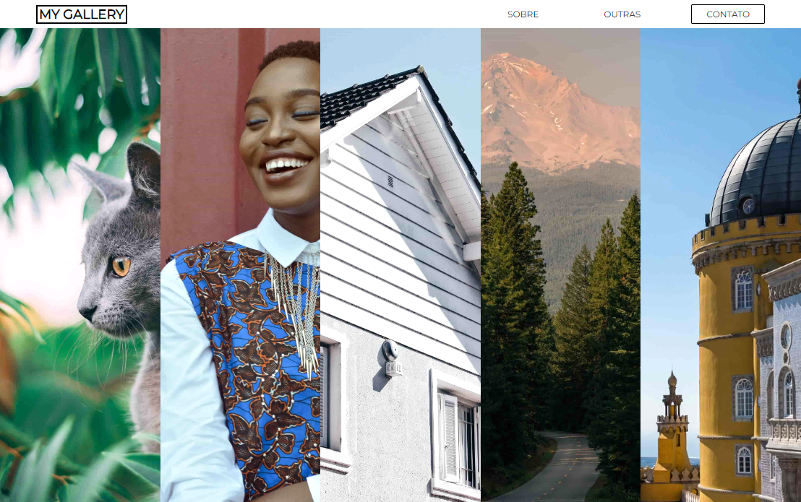

># Projeto pessoal My gallery

## Sobre o projeto
        Esse projeto pessoal foi construindo afim de testar minhas habilidades, principalmente em CSS com flex-basis, flex-grow e flex-shrink.

> 🔗 [Acesse clicando aqui!](https://luandersonalvesdev.github.io/my-gallery)

## 👨‍💻 APRENDIZADO
- Flex-basis, flex-grow e flex-shrink.

## 🛠️ TECNOLOGIAS USADAS 
- HTML
- CSS
- JavaScript
- GIT e Github

## 📧 CONTATO

- luaoderson@gmail.com